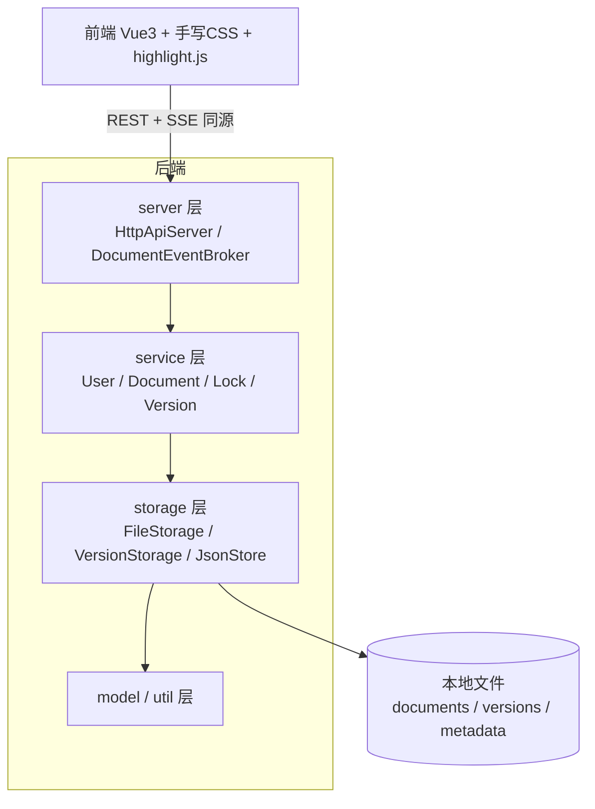

# ShareDoc 大作业 PPT 制作建议（逐页大纲）

> 用途：课堂展示 PPT 的实现指南。每页给出 **标题 / 内容要点 / 视觉建议 / 讲稿提示**，紧扣《JAVA 程序设计》大作业评分点（实现功能、工作量、文档、代码效率、面向对象规范）与代码实际。
>
> 建议总页数 **13–15 页**，展示时长 **8–10 分钟 + 现场演示 2–3 分钟**。

---

## 一、说明

PPT 的视觉风格请直接套用你们自己的模板，本文档**只规划内容与结构**，不规定配色、字体或版式。

下面每页的「视觉」一栏指的是**该页建议放置的内容**（图表 / 截图 / 要点），不限定外观；请按你们的模板自行排版。

- 截图素材可直接用项目运行后的页面：登录页、文档库、编辑器（语法高亮 + 协同栏）、版本抽屉（时间线 + diff）。
- 双开两个浏览器窗口、截「两人同时编辑同一文档」的那一刻，最有说服力。

---

## 二、逐页大纲

### 第 1 页 — 封面
- **标题**：ShareDoc · 多人协同文档编辑与版本控制系统
- **内容**：课程名《JAVA 程序设计》(25–26 春)、小组成员姓名 + 学号、日期。
- **视觉**：套用模板封面页；副标题一句话定位——"面向代码/文本的轻量级实时协同编辑系统"。

---

### 第 2 页 — 选题依据
- **要点**：
  - 协同编辑是高频刚需（腾讯文档 / Google Docs / VS Code Live Share）。
  - 三大技术难点：**并发控制、实时同步、版本管理**——恰好综合训练 Java 多线程 / 网络 / I/O / OOP。
  - 选择面向**代码与纯文本**的协同，贴近开发者协作场景。
- **视觉**：左侧竞品 logo 墙，右侧三个难点图标。
- **讲稿**：强调"选它是因为能把课程知识点（多线程、网络、面向对象）综合用起来"。

---

### 第 3 页 — 与竞品的区别（差异化）
- **要点（用对比表）**：

| 维度 | 主流竞品 | ShareDoc |
| --- | --- | --- |
| 协同模型 | OT/CRDT 字符级自动合并，复杂 | **细粒度区间锁**：不重叠区间多人并行，重叠排队 |
| 版本存储 | 黑盒云端 | **增量补丁 + 周期快照**，可解释、省空间 |
| 部署 | 重型云服务 | **单进程 jar / 一条 docker run** |

- **讲稿**：核心卖点——"我们没有照搬难实现的 OT/CRDT，而是设计了一套自洽、可验证、又能真并行的区间锁模型"。这是面试/答辩最能体现思考的一页。

---

### 第 4 页 — 系统总体架构
- **要点**：前后端分离 + 后端托管前端的单体分层架构。
- **视觉（架构图，可用下方 Mermaid 转图）**：

- **讲稿**：一句话讲清每层职责——server 只做协议、service 是业务核心、storage 管落盘。强调"无静态共享状态、构造注入"体现 OOP 规范（呼应评分点）。

---

### 第 5 页 — 主要功能总览
- **要点（四象限/四色卡片）**：
  1. **账号安全**：注册/登录/登出/改密码、PBKDF2 哈希、会话过期
  2. **文档管理**：增删改查、上传下载预览、权限控制、防穿越
  3. **协同编辑**：区间锁并行、排队晋升、SSE 实时同步、在线状态
  4. **版本控制**：增量版本、行级 diff、回滚、历史下载
- **视觉**：四宫格图标 + 关键词，配一张文档库截图。

---

### 第 6 页 — 关键技术①：细粒度区间锁（重点页）
- **要点**：
  - 光标/选区 → 扩展为**行级区间**申请锁。
  - 不重叠区间 → 多人**并行编辑**；重叠 → 进入 **FIFO 队列**，前序释放后**自动晋升**。
  - 他人保存后，其余锁**坐标自动平移**（`transformPosition`）。
  - 锁 **TTL 过期** + 关闭页面主动释放，杜绝僵尸锁。
- **视觉（示意图）**：一条文档，用户 A 锁 [0,10)、用户 B 锁 [20,30) 并行；用户 C 想锁 [5,15) → 排队。建议画成色块时间线。
- **讲稿**：这是项目最有技术含量的部分，讲清"为什么这样设计、解决了什么冲突"。

---

### 第 7 页 — 关键技术②：增量版本 + 周期快照
- **要点**：
  - 上传/回滚存 **FULL 完整快照**，编辑只存 **PATCH 修改片段**。
  - 60 秒内同人连续编辑**自动合并**为一个版本，省空间。
  - 每 20 个补丁**自动落一次快照** → 重建从最近快照回放，成本由 O(全历史) 降到 **O(快照间隔)**。
  - 行级 **LCS diff** 做版本差异对比。
- **视觉**：版本链示意（V1 FULL → V2~V20 PATCH → V21 FULL 快照），配版本抽屉截图（时间线 + 红绿 diff）。
- **讲稿**：体现"代码效率"评分点——重建复杂度优化。

---

### 第 8 页 — 关键技术③：实时同步 + 安全 + 持久化
- **要点（三栏）**：
  - **SSE 实时同步**：服务端单向推送锁/内容/在线状态事件；客户端在本地有未保存编辑时对远端补丁做**坐标映射（OT）** 后再应用。
  - **安全**：鉴权拦截抛 `UnauthorizedResponse` 中断管线；PBKDF2 加盐哈希；防路径穿越；机器可读错误码映射状态码。
  - **持久化**：`JsonStore` **临时文件 + 原子重命名**写入，重启数据自动恢复。
- **视觉**：三个小图标 + 关键词，可放一张"两个浏览器同时编辑"的截图。

---

### 第 9 页 — 类划分与 OOP 设计
- **要点**：27 个后端类，五层清晰分包；对外模型与持久化 DTO 解耦（`User`/`StoredUser`、`Document`/`StoredDocument`）；服务实例化 + 构造注入，无静态可变状态，便于测试。
- **视觉**：分包类图（model/server/service/storage/util 各列关键类名）。
- **讲稿**：直接对应评分点"是否符合面向对象设计规范"，点名解耦与单一职责。

---

### 第 10 页 — 程序亮点
- **要点（6 个，配图标）**：
  1. 真正可并行的协同模型
  2. 可解释的增量版本系统
  3. 以安全为先（修复真实鉴权绕过漏洞 + 回归测试）
  4. 干净的 OOP 分层、无静态共享状态
  5. 零配置可部署（jar / docker，数据持久化）
  6. 精致的深/浅主题 UI + 50 个自动化测试
- **视觉**：六边形/卡片排布，每条一句话。

---

### 第 11 页 — 实验报告概要：完成情况 + 问题与解决
- **要点**：
  - **完成情况**：列功能全部实现、后端 50 测试全绿、前端渲染验证。
  - **遇到的问题 → 解决**（挑 3 个最有代表性的讲）：
    - 鉴权拦截只设状态码不中断 → 抛异常中断 + 回归测试
    - CORS 预检 OPTIONS 被拦截 → 对 OPTIONS 放行
    - 版本随历史线性变慢 → 周期快照 + 就近回放
- **视觉**：左"完成"清单（✓），右"问题→解决"对照表。
- **讲稿**：诚实展示踩坑与修复过程，最能体现工程能力。

---

### 第 12 页 — 待实现功能与未解决问题
- **要点**：
  - 字符级 OT/CRDT 全自由协同（当前为区间锁，按设计取舍）。
  - 多实例横向扩展 + 数据库后端（当前单节点 + 本地文件）。
  - IME 中文输入法在锁边界的细节体验。
  - 元数据全量重写的写放大（超大规模）。
- **视觉**：简洁列表 + "未来展望"小标题。
- **讲稿**：表明对系统边界有清醒认识，留出拓展空间。

---

### 第 13 页 — 工作量分配表与贡献表
- **要点（两张表）**：
  - 工作量分配表：模块 ↔ 负责成员（架构、service、server/安全、存储、前端、测试、文档部署）。
  - 贡献表：成员姓名 / 学号 / 主要贡献 / **贡献百分比（合计 100%）**。
- **提示**：✎ 按小组实际填写；务必让百分比加总 = 100%（评分硬性项）。

---

### 第 14 页 — 现场演示 / 总结
- **演示脚本（2–3 分钟，建议预跑一遍）**：
  1. 打开 `http://localhost:8082/`，登录 admin。
  2. 文档库展示卡片、上传一个文件。
  3. 开两个浏览器窗口（admin + user），同一文档**不同区间同时编辑**，演示实时同步与在线状态。
  4. 故意编辑同一行 → 展示**排队**。
  5. 打开历史版本抽屉 → 看 diff → **回滚**，对方窗口实时刷新。
  6. 切换深/浅主题收尾。
- **总结**：一句话收获 + 致谢。

---

## 三、制作与答辩提示

- **截图获取**：`mvn exec:java` 启动后浏览器访问，分别截登录页、文档库、编辑器、版本抽屉；双开窗口截协同同步那一刻最有说服力。
- **架构图/示意图**：第 4、6、7、9 页的 Mermaid / 文字示意可用 draw.io、PPT SmartArt 或 Mermaid 在线编辑器转成图形。
- **代码片段**：如需展示代码，挑**区间锁晋升 `promoteQueuedLocks`** 或**版本重建 `reconstructVersionContent`** 一小段即可，别贴整页。
- **时间分配**：选题+差异化 1.5 分钟，架构+功能 2 分钟，三大关键技术 3 分钟，亮点+问题 1.5 分钟，演示 2.5 分钟。
- **答辩高频问题预案**：
  - "为什么用区间锁而不是 OT？" → 实现可控 + 仍支持并行，权衡取舍。
  - "版本怎么省空间又快？" → 补丁 + 周期快照 + 就近回放。
  - "并发安全怎么保证？" → 每文档监视器串行化 + LockService 同步 + 多线程测试验证。
  - "体现了哪些 OOP 规范？" → 分层、单一职责、依赖注入、模型与 DTO 解耦、无静态共享状态。
